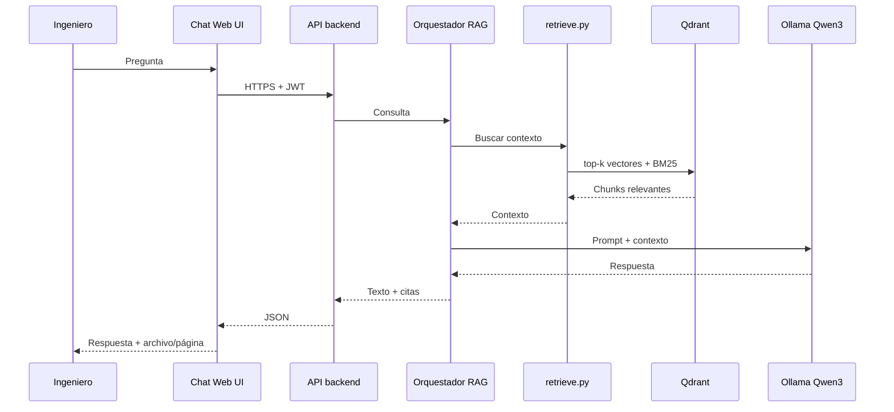

# DocumentAgent — Arquitectura del sistema

Documento de referencia del **sistema completo (S12)**. Complementa el diagrama visual en [`ArquitecturaSistema.drawio`](ArquitecturaSistema.drawio).

---

## ¿Qué es DocumentAgent?

Un asistente que responde preguntas sobre **reportes geotécnicos** (PDF, DOCX, Excel, etc.) usando solo el texto que fue indexado. Cada respuesta incluye **cita obligatoria**: nombre de archivo y número de página.

Todo corre **en local** (servidor en planta/mina). No usa OpenAI, Bedrock ni servicios de IA en la nube para inferencia.

---

## Idea en una frase

> El ingeniero pregunta en un chat web → el sistema busca los fragmentos relevantes en los documentos → un modelo local (Qwen3) redacta la respuesta con citas verificables.

---

## ¿Dónde vive el sistema?

| Entorno | Rol |
|---|---|
| **Planta / mina (producción)** | Destino final. Servidor GPU onsite en la red local. |
| **AWS EC2 (PoC S1–S6)** | Solo fase de prueba. Mismo código; se apaga al terminar el día. No es producción 24/7. |

El diagrama describe la **entrega final onsite**, no la nube como destino permanente.

---

## Usuarios

| Rol | Qué hace | Cómo se conecta |
|---|---|---|
| **Ingeniero** | Pregunta y lee respuestas con citas | Navegador → HTTPS (red local) |
| **Admin / Operador** | Sube documentos, backups, mantenimiento | Acceso al servidor (SSH / herramientas internas) |

---

## Hardware (servidor onsite)

| Recurso | Especificación |
|---|---|
| GPU | RTX 4090, A5000 o similar · **16–24 GB VRAM** |
| RAM | **32 GB** recomendados |
| Disco | PDF, chunks, índice Qdrant, modelos Ollama (~15 GB solo modelos) |
| Red | HTTPS dentro de la red de planta |

---

## Vista general (capas)

```
┌─────────────────────────────────────────────────────────────┐
│  USUARIOS          Ingenieros (navegador) · Admin           │
└───────────────────────────┬─────────────────────────────────┘
                            │ HTTPS
┌───────────────────────────▼─────────────────────────────────┐
│  ACCESO WEB (S7–S8)                                         │
│  Chat Web UI → Login (JWT) → API backend                    │
└───────────────────────────┬─────────────────────────────────┘
                            │
┌───────────────────────────▼─────────────────────────────────┐
│  MOTOR RAG (S3–S5)                                          │
│  Ingesta → Chunks → Embeddings + BM25 → Qdrant → retrieve   │
│  → Orquestador RAG → Ollama (Qwen3 14B) → Citas             │
└───────────────────────────┬─────────────────────────────────┘
                            │
┌───────────────────────────▼─────────────────────────────────┐
│  RUNTIME (S11)          Docker Compose único                │
│  App + Qdrant + Ollama                                      │
└───────────────────────────┬─────────────────────────────────┘
                            │
┌───────────────────────────▼─────────────────────────────────┐
│  PERSISTENCIA           Disco local / NAS + backup índice     │
└─────────────────────────────────────────────────────────────┘
```

---

## Flujo de una pregunta (paso a paso)

1. El **ingeniero** escribe una pregunta en el **Chat Web UI**.
2. **Login** valida la sesión (usuario + JWT).
3. La **API** envía la pregunta al **Orquestador RAG**.
4. **retrieve.py** busca en **Qdrant** los fragmentos más relevantes (búsqueda vectorial + **BM25 híbrido**).
5. El orquestador arma un prompt con esos fragmentos (solo contexto recuperado; no inventa cifras).
6. **Ollama** (Qwen3 14B en GPU) genera la respuesta.
7. El sistema devuelve texto + **citas clicables** (archivo + página).
8. La UI muestra la respuesta al ingeniero. Opcional: **streaming** de tokens e **historial** por usuario.



---

## Flujo de ingesta (documentos nuevos)

Cuando el operador agrega documentos:

1. Archivos en **PDF, DOCX, Excel/CSV** (y OCR piloto en escaneos seleccionados).
2. **ingest.py** extrae texto, pagina y trocea en **chunks** (~400–800 tokens).
3. Cada chunk guarda: `{doc_id, filename, page, text}`.
4. **FastEmbed** (multilingual-e5-large) genera vectores.
5. **Indexer** carga vectores en **Qdrant**.
6. Los datos persisten en disco (`data/raw/`, `data/chunks/`, `data/qdrant/`).

El admin sigue el **runbook** de alta de documentos (S11–S12).

---

## Componentes principales

### Acceso web (S7–S8)

| Componente | Función |
|---|---|
| **Chat Web UI** | Interfaz de chat: pregunta, respuesta, citas clicables, historial |
| **Login** | Autenticación simple (usuario/clave o JWT interno) |
| **API backend** | FastAPI (o similar): une UI, RAG y persistencia de sesiones |

### Ingesta (S2 + S9–S10)

| Componente | Función |
|---|---|
| **ingest.py** | Parsea PDF/DOCX/Excel; genera chunks con metadatos |
| **Chunks** | JSONL en `data/chunks/` |

### Búsqueda e indexación (S3 + S4)

| Componente | Función |
|---|---|
| **FastEmbed** | Embeddings locales (`multilingual-e5-large`) |
| **Indexer** | Sube vectores a Qdrant en batch |
| **BM25 híbrido** | Combina búsqueda por palabras clave con vectores (sondeos, fechas, códigos) |
| **Qdrant** | Base vectorial en `:6333` |
| **retrieve.py** | `index`, `search`, `eval` contra el set dorado |

### Generación RAG (S5)

| Componente | Función |
|---|---|
| **Orquestador RAG** | Une pregunta + contexto + llamada a Ollama; valida citas |
| **Ollama** | Servidor LLM local; modelo **Qwen3 14B** (fallback 8B si VRAM justa) |
| **Citas** | Salida `{archivo, página, extracto}`; sin cita válida → respuesta rechazada |

### Docker Compose (S11)

Un solo `docker compose` levanta:

| Servicio | Puerto | Volumen |
|---|---|---|
| **Qdrant** | 6333 | `data/qdrant/` |
| **Ollama** | 11434 (localhost) | `data/ollama/` |
| **App (API + Web)** | según config | código + estáticos |

Scripts Python (`ingest.py`, `retrieve.py`, orquestador) pueden correr en el **host** o empaquetarse en contenedor; el diagrama admite ambos.

---

## Almacenamiento

| Ubicación | Contenido |
|---|---|
| `data/raw/` | PDF y documentos originales |
| `data/chunks/` | Fragmentos indexables |
| `data/qdrant/` | Índice vectorial persistente |
| `data/ollama/` | Modelos descargados (Qwen3, etc.) |
| Backup (runbook) | Copia periódica del índice Qdrant |

---

## Seguridad (alcance S12)

| Aspecto | Decisión |
|---|---|
| Acceso usuarios | HTTPS en red local; login JWT |
| Puertos Qdrant / Ollama | Solo **localhost** (127.0.0.1), no expuestos a internet |
| PoC en AWS | Security Group: solo SSH desde IP del operador |
| **Fuera de alcance** | RBAC por documento, SSO corporativo, SharePoint |

---

## Stack tecnológico

| Capa | Tecnología |
|---|---|
| LLM | Ollama + **Qwen3 14B** Q4 |
| Embeddings | FastEmbed · **multilingual-e5-large** |
| Vectores | **Qdrant** v1.15 |
| Contenedores | **Docker Compose** |
| Backend | Python 3 · FastAPI (previsto) |
| Búsqueda | Vectorial + **BM25** híbrido |
| **No usa** | Bedrock, OpenAI, H100 |

---

## Fases del proyecto (contexto)

| Fase | Entregable clave |
|---|---|
| **S1–S6** | PoC: ingesta, retrieval, chat, evaluación, go/no-go |
| **S7–S8** | Chat web + login |
| **S9–S10** | Más PDFs, Excel/CSV, OCR piloto |
| **S11–S12** | Compose onsite, runbooks, capacitación, aceptación |

Este documento y el diagrama describen el **estado objetivo al cerrar S12**. El repo hoy está avanzado en S1–S3; ver [`README.md`](README.md) y [`gant.md`](gant.md) para el progreso real.

---

## Runbooks (operación S11–S12)

- **Alta de documentos:** copiar a `data/raw/` → `ingest.py` → `retrieve.py index`
- **Backup índice:** copiar `data/qdrant/` según procedimiento
- **Reinicio:** `docker compose up -d` → verificar una pregunta de prueba
- **Capacitación:** ~1 h para ingenieros + 10 preguntas de aceptación

---

## Qué no incluye este cierre

- Permisos por documento (RBAC)
- Single Sign-On (SSO)
- Conectores SharePoint / ERP / correo
- OCR masivo o PPTX como fuente principal
- Fine-tuning del modelo
- Inferencia en Bedrock u OpenAI

---

## Archivos relacionados

| Archivo | Descripción |
|---|---|
| [`ArquitecturaSistema.drawio`](ArquitecturaSistema.drawio) | Diagrama visual (draw.io) |
| [`alcance.md`](alcance.md) | Alcance del PoC y criterios go/no-go |
| [`gant.md`](gant.md) | Checklist por sprint |
| [`deploy/aws.md`](deploy/aws.md) | Guía PoC en AWS EC2 GPU |
| [`docker-compose.yml`](docker-compose.yml) | Qdrant |
| [`docker-compose.gpu.yml`](docker-compose.gpu.yml) | Ollama + GPU |

---

## Resumen ejecutivo

DocumentAgent es un **RAG local-first** para reportes geotécnicos: indexa documentos en Qdrant, recupera contexto con embeddings + BM25, y genera respuestas con **Ollama/Qwen3** citando siempre archivo y página. Tras validar el PoC en AWS, el sistema se **empaqueta en un servidor GPU en planta** con chat web, login y runbooks de operación — sin dependencia de APIs de IA externas.
